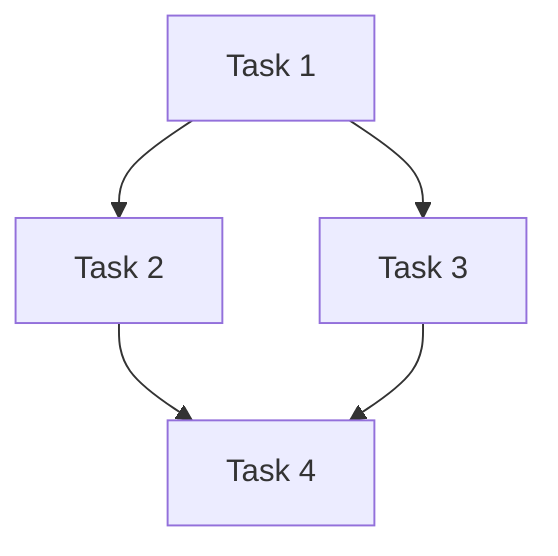

# Phase 4: 架构决策

## 目标

合并执行：架构选择 + 任务分析 + 团队创建 + 拓扑选择 + 角色选择。

## STATE VARIABLES

| 变量名 | 描述 | 来源 |
|--------|------|------|
| `{analysis_report}` | 综合分析报告 | Phase 3 |
| `{architecture_type}` | SAS/MAS 架构选择 | 本 Phase |
| `{topology_pattern}` | 拓扑模式 | 本 Phase |
| `{selected_roles}` | 选定的角色列表 | 本 Phase |
| `{team_name}` | 团队名称 | 本 Phase |
| `{adr_path}` | ADR 文件路径 | 本 Phase |

## 触发条件

- Phase 3 深度搜索完成后
- **快速模式跳过此阶段**

## 执行步骤

### Step 1: 架构选择 (SAS vs MAS)

```javascript
Task({
  description: "架构选择分析",
  prompt: `你是 architecture-selector。

## 综合分析报告
${analysis_report}

## 分析维度
1. 预计完成时间（分钟）
2. 涉及技术领域数量
3. 是否需要多角色并行探索
4. 风险级别

## 输出
\`\`\`yaml
架构选择: <SAS/MAS>
置信度: <0-1>
理由: <简要说明>
\`\`\``,
  subagent_type: "Plan",
  model: "opus",
  name: "architecture-selector"
})
```

**架构选择标准**：

| 指标 | SAS (单Agent) | MAS (多Agent) |
|------|---------------|---------------|
| 预计时间 | < 2小时 | > 2小时 |
| 技术领域 | 1-2个 | 3+个 |
| 并行需求 | 无 | 有 |
| 风险级别 | 低 | 中/高 |

### Step 2: 任务类型分析

| 用户描述 | 任务类型 | 优先级 |
|----------|----------|--------|
| 想要、做一个、需要 | 功能开发 | P2 |
| 有问题、很慢、报错 | Bug调试 | P0 |
| 审查、检查、看看 | 代码审查 | P1 |
| 设计、规划、架构 | 架构设计 | P2 |

### Step 3: 拓扑模式选择

| 拓扑 | 适用场景 | 说明 |
|------|----------|------|
| **星型** | 功能开发 | 统一协调，高效沟通 |
| **网状** | 架构设计 | 方案讨论，创意碰撞 |
| **流水线** | 标准流程 | 顺序执行，依赖清晰 |
| **竞技场** | 方案对比 | 代码审查，择优选择 |

### Step 4: 角色选择

#### 面向用户任务（必须有用户服务角色）

```yaml
功能开发:
  用户服务: product-owner + qa-verifier
  技术: database-designer + backend-dev + frontend-dev + test-engineer

问题排查:
  用户服务: product-owner
  技术: bug-hunter(2) + fix-implementer

新项目:
  用户服务: product-owner + user-translator + qa-verifier
  技术: architect + tech-lead + 完整开发团队
```

#### 纯技术任务

```yaml
代码审查:
  - security-reviewer
  - code-reviewer
  - test-coverage-reviewer

技术重构:
  - architect
  - code-reviewer(2)
  - test-engineer
```

### Step 5: 团队创建

```javascript
TeamCreate({
  team_name: "{project-name}-{timestamp}",
  description: "{任务描述}",
  agent_type: "sonnet"  // Coordinator 默认使用 Sonnet
})
```

### Step 6: 生成 ADR (Architecture Decision Record)

保存到: `docs/architecture/adr-{timestamp}.md`

## 输出格式

```markdown
# 架构决策

## 架构选择
- 类型: {SAS/MAS}
- 置信度: {confidence}
- 理由: {reason}

## 拓扑模式
{selected_topology}

## 角色配置

### 用户服务层
| 角色 | 人格 | 职责 |
|------|------|------|
| product-owner | Mary | 需求守护、验收决策 |
| qa-verifier | Quinn | 最终验收 |

### 技术执行层
| 角色 | 人格 | 职责 |
|------|------|------|
| ... | ... | ... |

## 任务分解


## ADR 参考
详见: {adr_path}
```

## NEXT STEP

完成本 Phase 后，加载: `phases/phase-05-execution.md`

## 相关参考

- **架构选择**: [references/architecture-selector.md](../references/architecture-selector.md)
- **拓扑模式**: [references/topology-patterns.md](../references/topology-patterns.md)
- **角色定义**: [references/roles.md](../references/roles.md)
- **Persona**: [personas/](../personas/)
