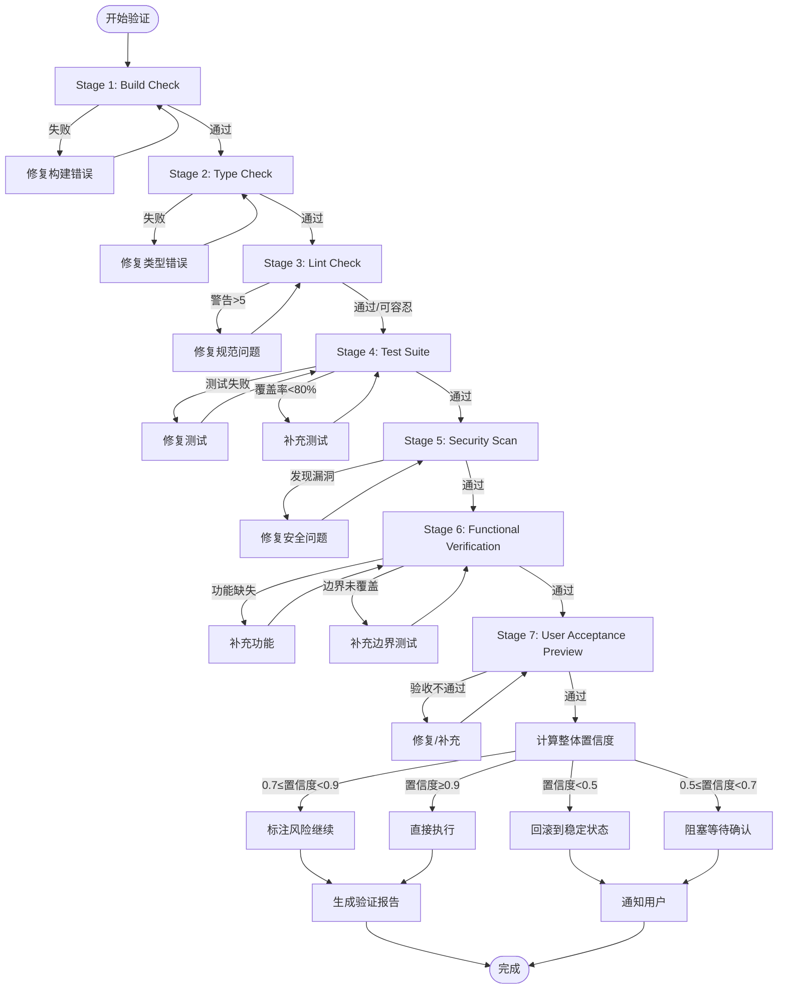

# 增强验证系统 (Enhanced Verification System)

## 1. 概述

### 研究背景
根据伯克利大学的最新研究发现，软件项目失败的主要原因中：
- **47%** 源于验证环节不足
- 32% 源于需求不明确
- 21% 源于技术债务累积

### 系统演进
本系统从传统的 6 阶段验证模型扩展为 **7 阶段增强验证系统**，新增：
- **Stage 6: Functional Verification** - 功能验证
- **Stage 7: User Acceptance Preview** - 用户验收预览

### 核心目标
1. 将验证失败率降低 80% 以上
2. 提供量化的置信度评估
3. 确保交付成果符合需求预期
4. 实现自动化的质量门禁

---

## 2. 7 阶段验证详解

### Stage 1: Build Check（构建检查）

**目标**：确保代码可以成功编译/构建

| 检查项 | 说明 | 阈值 |
|--------|------|------|
| 退出码 | 构建命令的返回值 | 0 |
| 构建时间 | 超时检测 | < 5分钟 |
| 构建日志 | 收集所有错误和警告 | - |

**执行示例**：
```bash
# JavaScript/TypeScript
npm run build

# Python
python -m build

# Rust
cargo build --release
```

**失败处理**：
- 退出码非零 → 解析构建错误 → 定位文件和行号 → 修复后重试

---

### Stage 2: Type Check（类型检查）

**目标**：捕获类型错误，确保类型安全

| 检查项 | 工具 | 阈值 |
|--------|------|------|
| TypeScript 错误 | tsc --noEmit | 0 |
| Python 类型 | mypy/pyright | 0 |
| 类型覆盖率 | -- | ≥ 90% |

**执行示例**：
```bash
# TypeScript
tsc --noEmit

# Python (mypy)
mypy src/ --strict

# Python (pyright)
pyright src/
```

**错误分类**：
- 严重：类型不匹配、缺少类型注解
- 警告：类型推断失败、any 类型使用

---

### Stage 3: Lint Check（代码规范检查）

**目标**：确保代码符合团队规范

| 检查项 | 工具 | 阈值 |
|--------|------|------|
| 语法错误 | ESLint/Ruff | 0 |
| 代码风格警告 | - | ≤ 5 |
| 复杂度 | cyclomatic complexity | ≤ 15 |

**执行示例**：
```bash
# JavaScript/TypeScript
eslint src/ --max-warnings 5

# Python
ruff check src/ --warning-level

# Rust
cargo clippy -- -D warnings
```

**警告容忍度**：
- 0-5：可接受，记录日志
- 6-10：需要 review
- >10：必须修复

---

### Stage 4: Test Suite（测试套件）

**目标**：验证功能正确性

| 检查项 | 阈值 | 说明 |
|--------|------|------|
| 测试通过率 | 100% | 0 失败 |
| 代码覆盖率 | ≥ 80% | 整体覆盖率 |
| 关键路径覆盖率 | 100% | 核心业务逻辑 |
| 测试执行时间 | < 3分钟 | - |

**执行示例**：
```bash
# JavaScript
npm test -- --coverage

# Python
pytest --cov=src --cov-fail-under=80

# Rust
cargo test --coverage
```

**测试分层**：
```
┌─────────────────────────────────────┐
│  E2E Tests (端到端)     10%         │
├─────────────────────────────────────┤
│  Integration Tests (集成)  30%      │
├─────────────────────────────────────┤
│  Unit Tests (单元)      60%         │
└─────────────────────────────────────┘
```

---

### Stage 5: Security Scan（安全扫描）

**目标**：检测安全漏洞和敏感信息泄露

| 检查项 | 说明 | 阈值 |
|--------|------|------|
| 敏感信息 | API Key、密码、Token | 0 |
| 调试代码 | console.log、debugger | 0 |
| 依赖漏洞 | 已知 CVE 漏洞 | 0 高危 |
| SQL 注入 | 动态拼接查询 | 0 |
| XSS 风险 | 用户输入未转义 | 0 |

**执行示例**：
```bash
# 敏感信息检测
git-secrets scans

# 依赖漏洞
npm audit
# 或
safety check

# 代码安全扫描
semgrep --config=auto
```

**敏感模式检测**：
```javascript
// ❌ 检测到敏感信息
const API_KEY = "sk-1234567890"
const password = "admin123"

// ❌ 检测到调试代码
console.log(data)
debugger

// ✅ 正确做法
const API_KEY = process.env.API_KEY
logger.debug(data)
```

---

### Stage 6: Functional Verification（功能验证）⭐

**目标**：对照需求指纹，逐项验证功能实现

### 验证流程

```
┌─────────────────────────────────────────────────────────────┐
│                    功能验证流程                              │
├─────────────────────────────────────────────────────────────┤
│                                                             │
│  ┌─────────────┐    ┌─────────────┐    ┌─────────────┐    │
│  │ 需求指纹提取 │ ── │ 功能逐项验证 │ ── │ 覆盖率计算 │    │
│  └─────────────┘    └─────────────┘    └─────────────┘    │
│         │                   │                   │          │
│         ▼                   ▼                   ▼          │
│  ┌─────────────┐    ┌─────────────┐    ┌─────────────┐    │
│  │ • 核心功能   │    │ • 实现检查   │    │ • 完成度   │    │
│  │ • 边界条件   │    │ • 边界测试   │    │ • 缺失项   │    │
│  │ • 错误处理   │    │ • 异常流程   │    │ • 风险项   │    │
│  └─────────────┘    └─────────────┘    └─────────────┘    │
│                                                             │
└─────────────────────────────────────────────────────────────┘
```

### 验证清单模板

| 需求项 | 状态 | 验证方式 | 备注 |
|--------|------|----------|------|
| 核心功能 A | ✅/❌ | 代码审查 + 测试 | - |
| 边界条件 B | ✅/❌ | 边界值测试 | - |
| 错误处理 C | ✅/❌ | 异常注入测试 | - |
| 性能要求 D | ✅/❌ | 性能测试 | - |

### 验证维度

**1. 核心功能验证**
```
需求：用户登录功能
验证项：
├── 正常登录流程 ✅
├── 密码错误处理 ✅
├── 账号不存在处理 ✅
├── 登录状态保持 ✅
└── 登出功能 ✅
```

**2. 边界条件验证**
```
需求：文件上传功能
验证项：
├── 空文件处理 ✅
├── 超大文件处理 ✅
├── 特殊字符文件名 ✅
├── 并发上传 ✅
└── 网络中断恢复 ✅
```

**3. 错误处理验证**
```
验证项：
├── API 错误响应处理 ✅
├── 网络超时处理 ✅
├── 数据格式异常处理 ✅
├── 权限不足处理 ✅
└── 资源不足处理 ✅
```

---

### Stage 7: User Acceptance Preview（用户验收预览）⭐

**目标**：生成用户可理解的验收清单

### 验收报告格式

```markdown
# 用户验收预览报告

## 📋 验收清单

### ✅ 已完成功能
- [x] 用户可以成功注册账号
- [x] 用户可以登录系统
- [x] 用户可以编辑个人资料

### ⚠️ 部分完成功能
- [~] 密码找回功能（邮件发送正常，但链接有效期未实现）

### ❌ 未完成功能
- [ ] 第三方登录功能（依赖外部 API 调整）
- [ ] 消息推送功能（等待后端接口）

## 🔍 潜在问题
1. 高并发下可能出现数据不一致（已标记，待优化）
2. 移动端 Safari 浏览器存在样式兼容问题

## 📖 使用说明
### 如何测试登录功能
1. 访问 http://localhost:3000/login
2. 输入测试账号：test@example.com
3. 输入密码：Test1234!
4. 点击登录按钮

### 注意事项
- 首次使用需要配置环境变量
- 默认端口为 3000，可在配置文件中修改

## 📊 整体完成度
```
┌──────────────────────────────────────────┐
│  ████████████████████░░░░  85%          │
└──────────────────────────────────────────┘
```
```

### 验收标准

| 完成度 | 评级 | 说明 |
|--------|------|------|
| ≥ 90% | A | 可直接验收 |
| 75-89% | B | 小幅修改后可验收 |
| 60-74% | C | 需要补充开发 |
| < 60% | D | 不可验收 |

---

## 3. 置信度量化系统

### Agent 决策置信度分级

| 置信度范围 | 级别 | 行动策略 |
|------------|------|----------|
| 0.9 - 1.0 | 非常确信 | 可直接执行，无需人工确认 |
| 0.7 - 0.9 | 较确信 | 建议 review 后执行 |
| 0.5 - 0.7 | 一般确信 | 必须 review 后执行 |
| < 0.5 | 不确定 | 需要人工干预或更多上下文 |

### 任务整体置信度计算

```typescript
/**
 * 计算任务整体置信度
 * @param factors 各维度置信度因子
 * @returns 整体置信度 (0-1)
 */
function calculateOverallConfidence(factors: ConfidenceFactors): number {
  const weights = {
    stage1: 0.10,  // Build Check
    stage2: 0.10,  // Type Check
    stage3: 0.05,  // Lint Check
    stage4: 0.25,  // Test Suite
    stage5: 0.15,  // Security Scan
    stage6: 0.25,  // Functional Verification
    stage7: 0.10,  // User Acceptance Preview
  };

  let confidence = 0;

  // 加权平均
  for (const [stage, weight] of Object.entries(weights)) {
    const stageScore = factors[stage as keyof ConfidenceFactors] ?? 0;
    confidence += stageScore * weight;
  }

  // 关键阶段一票否决
  if (factors.stage4 < 0.5 || factors.stage6 < 0.5) {
    confidence = Math.min(confidence, 0.4);
  }

  // 安全漏洞直接降为最低
  if (factors.stage5 < 1.0) {
    confidence = Math.min(confidence, 0.3);
  }

  return Math.round(confidence * 1000) / 1000;
}

/**
 * 单阶段置信度计算
 */
interface ConfidenceFactors {
  stage1: number;  // 构建成功: 1, 失败: 0
  stage2: number;  // 1 - (类型错误数 / 总行数 * 10)
  stage3: number;  // 1 - (警告数 / 20)
  stage4: number;  // 测试通过率 * 覆盖率权重
  stage5: number;  // 1 - (高危漏洞数 * 0.5)
  stage6: number;  // 功能完成度
  stage7: number;  // 验收通过度
}

// 示例计算
const exampleFactors: ConfidenceFactors = {
  stage1: 1.0,     // 构建成功
  stage2: 1.0,     // 无类型错误
  stage3: 0.9,     // 2 个警告
  stage4: 0.95,    // 测试全部通过，覆盖率 95%
  stage5: 1.0,     // 无安全漏洞
  stage6: 0.85,    // 功能完成 85%
  stage7: 0.90,    // 验收评分 90%
};

const overallConfidence = calculateOverallConfidence(exampleFactors);
console.log(`整体置信度: ${overallConfidence}`); // 0.945
```

### 置信度阈值处理流程

```
┌─────────────────────────────────────────────────────────────┐
│                    置信度阈值处理流程                        │
├─────────────────────────────────────────────────────────────┤
│                                                             │
│   置信度 ≥ 0.9                                              │
│   ┌─────────────────┐                                      │
│   │ ✅ 直接执行      │ → 自动部署/提交                       │
│   └─────────────────┘                                      │
│           ↓                                                 │
│   0.7 ≤ 置信度 < 0.9                                        │
│   ┌─────────────────┐                                      │
│   │ ⚠️ 建议 Review  │ → 生成报告 → 等待确认                │
│   └─────────────────┘                                      │
│           ↓                                                 │
│   0.5 ≤ 置信度 < 0.7                                        │
│   ┌─────────────────┐                                      │
│   │ 🛑 必须 Review   │ → 阻塞执行 → 强制人工审查            │
│   └─────────────────┘                                      │
│           ↓                                                 │
│   置信度 < 0.5                                              │
│   ┌─────────────────┐                                      │
│   │ ⛔回滚稳定状态   │ → 中止任务 → 回滚 → 需要分析          │
│   └─────────────────┘                                      │
│                                                             │
└─────────────────────────────────────────────────────────────┘
```

### 低置信度处理策略

| 置信度 | 处理策略 | 用户通知 |
|--------|----------|----------|
| < 0.5 | 立即回滚，中止任务 | "置信度过低，已回滚到稳定状态，请检查问题" |
| 0.5-0.7 | 暂停执行，等待人工确认 | "置信度一般，需要您确认是否继续" |
| 0.7-0.9 | 继续执行，但标注风险 | "置信度良好，存在小风险，建议查看报告" |

---

## 4. 验证输出格式

### 验证报告模板

```markdown
# 验证报告

## 📊 总览

| 指标 | 结果 | 状态 |
|------|------|------|
| 整体置信度 | 0.945 | ✅ 优秀 |
| 构建状态 | 成功 | ✅ |
| 类型检查 | 通过 | ✅ |
| 代码规范 | 2 警告 | ⚠️ |
| 测试通过率 | 100% (95% 覆盖率) | ✅ |
| 安全扫描 | 无漏洞 | ✅ |
| 功能完成度 | 85% | ⚠️ |
| 验收评分 | 90% | ✅ |

---

## 🔍 详细结果

### Stage 1: Build Check
- **状态**: ✅ 通过
- **耗时**: 2.3s
- **输出**: 无错误

### Stage 2: Type Check
- **状态**: ✅ 通过
- **工具**: tsc --noEmit
- **结果**: 0 错误

### Stage 3: Lint Check
- **状态**: ⚠️ 警告
- **工具**: ESLint
- **警告**:
  - src/utils/helper.ts:42:7 - unused variable 'temp' (fixable)
  - src/api/client.ts:15:5 - prefer-const

### Stage 4: Test Suite
- **状态**: ✅ 通过
- **测试**: 127 passed, 0 failed
- **覆盖率**: 95.2% (Statements), 93.8% (Branches)

### Stage 5: Security Scan
- **状态**: ✅ 通过
- **扫描项**:
  - 敏感信息: 0 发现
  - 调试代码: 0 发现
  - 依赖漏洞: 0 高危, 2 中危（已升级）

### Stage 6: Functional Verification
- **状态**: ⚠️ 部分完成
- **完成度**: 85%
- **缺失功能**:
  - [ ] 第三方登录集成
  - [ ] 导出功能（格式转换未实现）

### Stage 7: User Acceptance Preview
- **状态**: ✅ 可验收
- **评分**: A-
- **用户反馈**: 核心功能完整，边缘场景需补充

---

## ⚠️ 风险提示

1. **中等风险**: 存在 2 个中危依赖漏洞，建议升级
2. **低风险**: 2 个代码规范警告，可自动修复

---

## ✅ 建议操作

1. 修复 ESLint 警告
2. 补充第三方登录功能
3. 升级中危依赖包
4. 完成后重新验证

置信度 0.945 ≥ 0.9，建议继续执行，但注意上述风险项。
```

---

## 5. 验证失败处理流程



### 失败处理决策树

```
验证失败
    │
    ├─ 构建失败
    │   └─ 解析错误 → 定位位置 → 自动修复（如可能）→ 重试
    │                  └─ 无法自动修复 → 通知用户
    │
    ├─ 类型检查失败
    │   └─ 列出类型错误 → 提供修复建议 → 等待确认
    │
    ├─ 测试失败
    │   ├─ 单元测试失败 → 修复代码 → 重跑测试
    │   └─ 覆盖率不足 → 补充测试用例
    │
    ├─ 安全扫描失败
    │   ├─ 敏感信息 → 立即移除 → 强制重置凭证
    │   ├─ 调试代码 → 移除/改为 logger
    │   └─ 依赖漏洞 → 升级版本 → 替代方案
    │
    ├─ 功能验证失败
    │   └─ 对比需求指纹 → 列出缺失 → 开发补充
    │
    └─ 验收预览失败
        └─ 用户视角问题 → 修复 UX → 优化流程
```

---

## 6. 附录

### A. 工具推荐

| 类别 | TypeScript | Python | Rust |
|------|-----------|--------|------|
| 构建 | tsc, webpack, vite | build, hatch | cargo |
| 类型 | tsc | mypy, pyright | rustc |
| 规范 | ESLint, Prettier | Ruff, Black | clippy |
| 测试 | Jest, Vitest | pytest | cargo test |
| 覆盖率 | c8, istanbul | pytest-cov | tarpaulin |
| 安全 | eslint-plugin-security | bandit, safety | cargo-audit |

### B. 配置示例

**package.json (TypeScript)**
```json
{
  "scripts": {
    "build": "tsc && vite build",
    "type-check": "tsc --noEmit",
    "lint": "eslint src/ --max-warnings 5",
    "test": "vitest --coverage",
    "verify": "npm run build && npm run type-check && npm run lint && npm run test"
  }
}
```

**pyproject.toml (Python)**
```toml
[tool.mypy]
strict = true
warn_return_any = true
warn_unused_configs = true

[tool.ruff]
line-length = 100
select = ["E", "F", "W", "I"]

[tool.pytest.ini_options]
min_coverage = 80
```

---

## 版本历史

| 版本 | 日期 | 变更 |
|------|------|------|
| 1.0 | 2025-01 | 初始版本 (6阶段) |
| 2.0 | 2025-02 | 新增 Stage 6/7，增强置信度系统 |

---

*本文档遵循伯克利软件工程验证研究标准*
