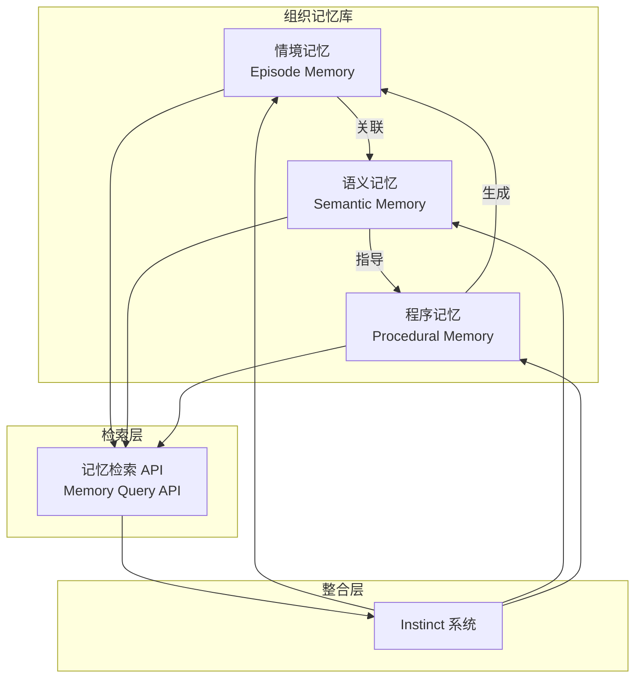

# 组织记忆库 (Organizational Memory)

## 1. 概述

组织记忆库是一个基于人类记忆系统设计的智能存储与检索系统，旨在帮助团队保留和重用知识、经验和最佳实践。系统采用三层记忆架构：

- **情境记忆 (Episode Memory)**：存储具体事件和经历
- **语义记忆 (Semantic Memory)**：存储概念、模式和知识
- **程序记忆 (Procedural Memory)**：存储操作流程和技能

---

## 2. 架构图

```
┌─────────────────────────────────────────────────────────────────────────┐
│                           组织记忆库架构                                  │
├─────────────────────────────────────────────────────────────────────────┤
│                                                                         │
│  ┌─────────────────┐  ┌─────────────────┐  ┌─────────────────┐         │
│  │  情境记忆        │  │  语义记忆        │  │  程序记忆        │         │
│  │  Episode Memory │  │ Semantic Memory │  │ Procedural Memory│         │
│  ├─────────────────┤  ├─────────────────┤  ├─────────────────┤         │
│  │ • 失败案例       │  │ • 设计模式       │  │ • 标准流程       │         │
│  │ • 成功案例       │  │ • 反模式         │  │ • 操作指南       │         │
│  │ • 学习事件       │  │ • 最佳实践       │  │ • 检查清单       │         │
│  │ • 决策记录       │  │ • 约束条件       │  │ • 故障排除       │         │
│  └─────────────────┘  └─────────────────┘  └─────────────────┘         │
│           │                     │                     │                 │
│           └─────────────────────┼─────────────────────┘                 │
│                                 │                                       │
│                     ┌───────────▼───────────┐                           │
│                     │   记忆检索 API         │                           │
│                     │   Memory Query API    │                           │
│                     └───────────┬───────────┘                           │
│                                 │                                       │
│                     ┌───────────▼───────────┐                           │
│                     │   Instinct 系统        │                           │
│                     │   (自动触发与整合)     │                           │
│                     └───────────────────────┘                           │
│                                                                         │
└─────────────────────────────────────────────────────────────────────────┘
```

### Mermaid 图表



---

## 3. Episode Memory（情境记忆）

情境记忆存储具体的事件和经历，包括失败案例、成功案例和学习事件。

### 数据结构

```yaml
episode:
  id: "ep-20260218-001"
  type: "failure" | "success" | "learning"
  timestamp: "2026-02-18T10:30:00Z"

  context:
    task: "任务描述"
    agents: ["agent1", "agent2"]
    requirements: ["req-001"]
    environment: "dev" | "staging" | "production"

  event:
    description: "事件描述"
    trigger: "触发原因"
    outcome: "结果"
    duration: "持续时间"

  learning:
    rootCause: "根本原因分析"
    prevention: "预防措施"
    confidence: 0.9
    applicable: "应用范围"

  tags: ["tag1", "tag2", "tag3"]
  related: ["ep-xxx", "kn-xxx", "pr-xxx"]
```

### 示例

```yaml
episode:
  id: "ep-20260218-001"
  type: "failure"
  timestamp: "2026-02-18T10:30:00Z"

  context:
    task: "实现用户认证模块"
    agents: ["team-v4-developer", "team-v4-tester"]
    requirements: ["AUTH-001", "SECURITY-012"]
    environment: "dev"

  event:
    description: "JWT token 验证失败导致所有请求被拒绝"
    trigger: "token secret 配置不一致"
    outcome: "回滚到上一个版本，修复配置后重新部署"
    duration: "2小时"

  learning:
    rootCause: "环境变量在不同环境中的配置未同步"
    prevention: "实现配置验证检查，确保所有环境的密钥配置一致"
    confidence: 0.95
    applicable: "所有涉及敏感配置的部署"

  tags: ["authentication", "jwt", "configuration", "deployment"]
  related: ["kn-config-validation", "pr-deployment-checklist"]
```

---

## 4. Semantic Memory（语义记忆）

语义记忆存储抽象的概念、模式和知识。

### 数据结构

```yaml
knowledge:
  id: "kn-20260218-001"
  category: "pattern" | "anti-pattern" | "best-practice" | "constraint"
  concept: "概念名称"
  definition: "详细定义"

  applications:
    - "应用场景1"
    - "应用场景2"

  evidence:
    - episode: "ep-xxx"
      relevance: 0.85
      support: "positive" | "negative"
    - episode: "ep-yyy"
      relevance: 0.72
      support: "positive"

  confidence: 0.9
  lastValidated: "2026-02-18T10:30:00Z"

  tags: ["tag1", "tag2"]
  related: ["kn-xxx", "pr-xxx"]
```

### 示例

```yaml
knowledge:
  id: "kn-20260218-001"
  category: "best-practice"
  concept: "配置集中管理"
  definition: "将所有配置信息集中存储和管理，通过环境变量进行区分，确保配置的一致性和可追溯性"

  applications:
    - "多环境部署"
    - "密钥管理"
    - "功能开关"

  evidence:
    - episode: "ep-20260218-001"
      relevance: 0.95
      support: "positive"
    - episode: "ep-20260115-042"
      relevance: 0.88
      support: "positive"

  confidence: 0.95
  lastValidated: "2026-02-18T10:30:00Z"

  tags: ["configuration", "best-practice", "deployment"]
  related: ["pr-deployment-checklist", "kn-env-var-management"]
```

---

## 5. Procedural Memory（程序记忆）

程序记忆存储操作流程、技能和标准作业程序。

### 数据结构

```yaml
procedure:
  id: "pr-20260218-001"
  name: "流程名称"
  version: "1.0"

  trigger:
    condition: "触发条件描述"
    type: "manual" | "automatic" | "hybrid"
    priority: "high" | "medium" | "low"

  steps:
    - step: 1
      action: "操作描述"
      agent: "负责角色/Agent"
      input: "所需输入"
      output: "预期输出"
      validation: "验证方式"
      estimatedTime: "预计耗时"

    - step: 2
      action: "下一步操作"
      agent: "负责角色/Agent"
      input: "所需输入"
      output: "预期输出"
      validation: "验证方式"
      estimatedTime: "预计耗时"

  rollback:
    condition: "回滚条件"
    action: "回滚操作步骤"

  prerequisites:
    - "前置条件1"
    - "前置条件2"

  confidence: 0.95
  lastExecuted: "2026-02-18T10:30:00Z"

  tags: ["tag1", "tag2"]
  related: ["ep-xxx", "kn-xxx"]
```

### 示例

```yaml
procedure:
  id: "pr-20260218-001"
  name: "生产环境部署流程"
  version: "2.1"

  trigger:
    condition: "代码通过所有测试并获得批准"
    type: "hybrid"
    priority: "high"

  steps:
    - step: 1
      action: "运行预部署检查"
      agent: "team-v4-tester"
      input: "待部署代码分支"
      output: "检查报告"
      validation: "所有检查项通过"
      estimatedTime: "5分钟"

    - step: 2
      action: "验证配置一致性"
      agent: "team-v4-ops"
      input: "环境配置文件"
      output: "配置验证结果"
      validation: "配置文件无差异"
      estimatedTime: "2分钟"

    - step: 3
      action: "执行部署"
      agent: "team-v4-developer"
      input: "部署包"
      output: "部署成功确认"
      validation: "服务健康检查通过"
      estimatedTime: "10分钟"

    - step: 4
      action: "冒烟测试"
      agent: "team-v4-tester"
      input: "生产环境URL"
      output: "测试结果"
      validation: "核心功能正常"
      estimatedTime: "5分钟"

  rollback:
    condition: "任何步骤失败或健康检查不通过"
    action: "执行回滚脚本，恢复上一个稳定版本"

  prerequisites:
    - "所有测试通过"
    - "部署审批已获得"
    - "回滚脚本已准备"

  confidence: 0.98
  lastExecuted: "2026-02-18T10:30:00Z"

  tags: ["deployment", "production", "sop"]
  related: ["ep-20260218-001", "kn-config-validation"]
```

---

## 6. 记忆检索 API

### TypeScript 接口定义

```typescript
/**
 * 记忆类型枚举
 */
enum MemoryType {
  EPISODE = 'episode',
  SEMANTIC = 'semantic',
  PROCEDURAL = 'procedural',
  ALL = 'all'
}

/**
 * 排序方式枚举
 */
enum SortBy {
  RELEVANCE = 'relevance',
  RECENCY = 'recency',
  CONFIDENCE = 'confidence'
}

/**
 * 记忆查询接口
 */
interface MemoryQuery {
  /** 查询的记忆类型 */
  type: MemoryType;

  /** 关键词搜索 */
  keywords?: string[];

  /** 标签过滤 */
  tags?: string[];

  /** 时间范围过滤 */
  timeRange?: {
    start: string;  // ISO 8601 格式
    end: string;    // ISO 8601 格式
  };

  /** 上下文相关度过滤 */
  context?: string;

  /** 最小置信度 */
  minConfidence?: number;

  /** 返回结果数量限制 */
  limit?: number;

  /** 排序方式 */
  sortBy?: SortBy;
}

/**
 * 基础记忆接口
 */
interface BaseMemory {
  id: string;
  confidence: number;
  tags: string[];
  related: string[];
}

/**
 * 情境记忆接口
 */
interface EpisodeMemory extends BaseMemory {
  type: 'episode';
  episodeType: 'failure' | 'success' | 'learning';
  timestamp: string;
  context: {
    task: string;
    agents: string[];
    requirements: string[];
    environment?: string;
  };
  event: {
    description: string;
    trigger: string;
    outcome: string;
    duration?: string;
  };
  learning: {
    rootCause?: string;
    prevention?: string;
    applicable?: string;
  };
}

/**
 * 语义记忆接口
 */
interface SemanticMemory extends BaseMemory {
  type: 'semantic';
  category: 'pattern' | 'anti-pattern' | 'best-practice' | 'constraint';
  concept: string;
  definition: string;
  applications: string[];
  evidence: Array<{
    episode: string;
    relevance: number;
    support: 'positive' | 'negative';
  }>;
  lastValidated: string;
}

/**
 * 程序记忆接口
 */
interface ProceduralMemory extends BaseMemory {
  type: 'procedural';
  name: string;
  version: string;
  trigger: {
    condition: string;
    type: 'manual' | 'automatic' | 'hybrid';
    priority: 'high' | 'medium' | 'low';
  };
  steps: Array<{
    step: number;
    action: string;
    agent: string;
    input?: string;
    output?: string;
    validation?: string;
    estimatedTime?: string;
  }>;
  rollback?: {
    condition: string;
    action: string;
  };
  prerequisites?: string[];
  lastExecuted?: string;
}

/**
 * 记忆联合类型
 */
type Memory = EpisodeMemory | SemanticMemory | ProceduralMemory;

/**
 * 记忆检索结果接口
 */
interface MemoryResult {
  /** 匹配的记忆列表 */
  memories: Memory[];

  /** 总匹配数量 */
  totalFound: number;

  /** 查询耗时（毫秒） */
  queryTime: number;

  /** 相关度分数（如果按相关度排序） */
  scores?: number[];
}

/**
 * 组织记忆库客户端接口
 */
interface OrganizationalMemoryClient {
  /**
   * 查询记忆
   */
  query(query: MemoryQuery): Promise<MemoryResult>;

  /**
   * 添加记忆
   */
  add(memory: Memory): Promise<string>;

  /**
   * 更新记忆
   */
  update(id: string, updates: Partial<Memory>): Promise<boolean>;

  /**
   * 删除记忆
   */
  delete(id: string): Promise<boolean>;

  /**
   * 获取相关记忆
   */
  getRelated(id: string, limit?: number): Promise<Memory[]>;
}
```

### 使用示例

```typescript
// 查询最近的失败案例
const failuresQuery: MemoryQuery = {
  type: MemoryType.EPISODE,
  keywords: ['deployment', 'failure'],
  minConfidence: 0.7,
  limit: 10,
  sortBy: SortBy.RECENCY
};

const failures = await memoryClient.query(failuresQuery);

// 查询最佳实践
const bestPracticesQuery: MemoryQuery = {
  type: MemoryType.SEMANTIC,
  tags: ['best-practice', 'security'],
  minConfidence: 0.8
};

const bestPractices = await memoryClient.query(bestPracticesQuery);

// 查询部署流程
const deploymentProcedure: MemoryQuery = {
  type: MemoryType.PROCEDURAL,
  keywords: ['deployment', 'production']
};

const procedures = await memoryClient.query(deploymentProcedure);
```

---

## 7. 记忆存储位置

### 目录结构

```
project-root/
├── .claude/
│   └── memory/
│       ├── episodes/           # 情境记忆
│       │   ├── 2026/
│       │   │   ├── 02/
│       │   │   │   ├── ep-20260218-001.yaml
│       │   │   │   └── ep-20260218-002.yaml
│       │   │   └── ...
│       │   └── index.json
│       │
│       ├── semantic/           # 语义记忆
│       │   ├── patterns/
│       │   │   ├── kn-20260218-001.yaml
│       │   │   └── kn-20260218-002.yaml
│       │   ├── best-practices/
│       │   └── anti-patterns/
│       │   └── index.json
│       │
│       ├── procedural/         # 程序记忆
│       │   ├── deployment/
│       │   │   ├── pr-20260218-001.yaml
│       │   │   └── pr-20260218-002.yaml
│       │   ├── testing/
│       │   └── index.json
│       │
│       └── index.json          # 全局索引
```

### 索引文件格式

```json
{
  "version": "1.0",
  "lastUpdated": "2026-02-18T10:30:00Z",
  "statistics": {
    "totalEpisodes": 42,
    "totalSemantic": 28,
    "totalProcedural": 15,
    "lastWeekAdded": 5
  },
  "episodes": {
    "ep-20260218-001": {
      "type": "failure",
      "timestamp": "2026-02-18T10:30:00Z",
      "tags": ["authentication", "jwt"],
      "confidence": 0.95
    }
  },
  "semantic": {
    "kn-20260218-001": {
      "category": "best-practice",
      "concept": "配置集中管理",
      "confidence": 0.95
    }
  },
  "procedural": {
    "pr-20260218-001": {
      "name": "生产环境部署流程",
      "version": "2.1",
      "confidence": 0.98
    }
  }
}
```

---

## 8. 与 Instinct 系统的整合

### 整合架构

```
┌─────────────────────────────────────────────────────────────────────┐
│                        Instinct 系统                                  │
├─────────────────────────────────────────────────────────────────────┤
│                                                                     │
│  ┌───────────────┐      ┌───────────────┐      ┌───────────────┐   │
│  │   事件监听     │ ───> │   模式识别     │ ───> │   行为触发     │   │
│  │ Event Listen  │      │ Pattern Match │      │ Action Trigger│   │
│  └───────────────┘      └───────────────┘      └───────────────┘   │
│           │                       │                       │         │
│           │                       ▼                       │         │
│           │              ┌───────────────┐                │         │
│           │              │ 组织记忆库     │                │         │
│           │              │ Memory Store  │                │         │
│           │              └───────────────┘                │         │
│           │                       ▲                       │         │
│           │                       │                       │         │
│           └───────────────────────┼───────────────────────┘         │
│                                   │                                 │
│  ┌────────────────────────────────┼─────────────────────────────┐   │
│  │                                │                             │   │
│  │  1. 监听项目事件                │  4. 根据记忆调整行为          │   │
│  │  2. 查询相关记忆                │  5. 记录新经验                │   │
│  │  3. 匹配模式和流程              │  6. 更新置信度               │   │
│  └────────────────────────────────┼─────────────────────────────┘   │
│                                    │                                │
└────────────────────────────────────┼────────────────────────────────┘
                                     │
                                     ▼
                            ┌───────────────┐
                            │  项目上下文    │
                            │ Project Repo  │
                            └───────────────┘
```

### 整合方式

#### 1. 自动记忆记录

Instinct 系统监听项目事件，自动记录到记忆库：

```typescript
// Instinct 事件处理示例
class InstinctMemoryHandler {
  async handleEvent(event: ProjectEvent) {
    // 分析事件类型
    const analysis = await this.analyzeEvent(event);

    // 查找相关记忆
    const relatedMemories = await memoryClient.query({
      type: MemoryType.ALL,
      keywords: analysis.keywords,
      limit: 5
    });

    // 如果是重要事件，记录为情境记忆
    if (analysis.isSignificant) {
      const episode: EpisodeMemory = {
        type: 'episode',
        id: `ep-${Date.now()}`,
        episodeType: analysis.outcome,
        timestamp: event.timestamp,
        context: event.context,
        event: {
          description: analysis.description,
          trigger: event.trigger,
          outcome: event.outcome
        },
        learning: analysis.learnings,
        confidence: analysis.confidence,
        tags: analysis.tags,
        related: relatedMemories.memories.map(m => m.id)
      };

      await memoryClient.add(episode);
    }
  }
}
```

#### 2. 自动流程触发

根据记忆库中的程序记忆，自动触发相应流程：

```typescript
// 自动流程触发示例
class ProceduralAutomation {
  async checkAndTrigger(context: ProjectContext) {
    // 查询适用的程序记忆
    const procedures = await memoryClient.query({
      type: MemoryType.PROCEDURAL,
      context: JSON.stringify(context),
      minConfidence: 0.8
    });

    for (const procedure of procedures.memories as ProceduralMemory[]) {
      // 检查触发条件
      if (await this.evaluateTrigger(procedure.trigger, context)) {
        // 执行流程
        await this.executeProcedure(procedure, context);
      }
    }
  }
}
```

#### 3. 智能建议系统

基于语义记忆提供智能建议：

```typescript
// 智能建议示例
class SmartAdviser {
  async advise(task: Task): Promise<Advice[]> {
    // 查询相关最佳实践
    const bestPractices = await memoryClient.query({
      type: MemoryType.SEMANTIC,
      category: 'best-practice',
      keywords: task.keywords,
      minConfidence: 0.7
    });

    // 查询相关失败案例
    const failures = await memoryClient.query({
      type: MemoryType.EPISODE,
      episodeType: 'failure',
      keywords: task.keywords,
      minConfidence: 0.6
    });

    return this.compileAdvice(bestPractices, failures);
  }
}
```

#### 4. 记忆更新机制

根据新经验自动更新记忆的置信度：

```typescript
// 记忆更新示例
class MemoryUpdater {
  async updateFromEvent(event: ProjectEvent) {
    // 查找相关记忆
    const related = await memoryClient.query({
      type: MemoryType.ALL,
      keywords: event.keywords,
      limit: 10
    });

    for (const memory of related.memories) {
      // 计算新证据
      const evidence = this.calculateEvidence(event, memory);

      // 更新置信度
      const newConfidence = this.updateConfidence(
        memory.confidence,
        evidence
      );

      await memoryClient.update(memory.id, {
        confidence: newConfidence
      });
    }
  }
}
```

### 配置示例

```yaml
# .claude/instinct-config.yaml
memory:
  enabled: true
  autoRecord: true
  updateConfidence: true

  triggers:
    - event: "deployment"
      action: "record_episode"
    - event: "failure"
      action: "record_episode"
      priority: "high"
    - event: "success"
      action: "update_semantic"

  procedures:
    - name: "pre_deployment_check"
      trigger: "before_deployment"
      enabled: true
    - name: "post_failure_analysis"
      trigger: "after_failure"
      enabled: true
```

---

## 附录

### A. 记忆 ID 命名规范

- **情境记忆**: `ep-{YYYYMMDD}-{序号}`
- **语义记忆**: `kn-{YYYYMMDD}-{序号}`
- **程序记忆**: `pr-{YYYYMMDD}-{序号}`

### B. 置信度计算

```typescript
function calculateConfidence(
  evidence: number,
  supports: number,
  total: number
): number {
  // 基础置信度
  let confidence = evidence / total;

  // 时间衰减（最近的事件权重更高）
  const ageInDays = getAgeInDays();
  const decayFactor = Math.exp(-ageInDays / 365);

  // 支持度加权
  const supportFactor = supports / total;

  return Math.min(1, confidence * decayFactor * (1 + supportFactor));
}
```

### C. 相关度计算

```typescript
function calculateRelevance(
  query: MemoryQuery,
  memory: Memory
): number {
  let score = 0;

  // 关键词匹配
  if (query.keywords) {
    const matches = query.keywords.filter(k =>
      memory.tags.some(t => t.includes(k))
    ).length;
    score += matches / query.keywords.length * 0.4;
  }

  // 标签匹配
  if (query.tags) {
    const matches = query.tags.filter(t =>
      memory.tags.includes(t)
    ).length;
    score += matches / query.tags.length * 0.3;
  }

  // 置信度
  score += memory.confidence * 0.3;

  return score;
}
```

---

**文档版本**: 1.0
**最后更新**: 2026-02-18
**维护者**: team-v4-developer
