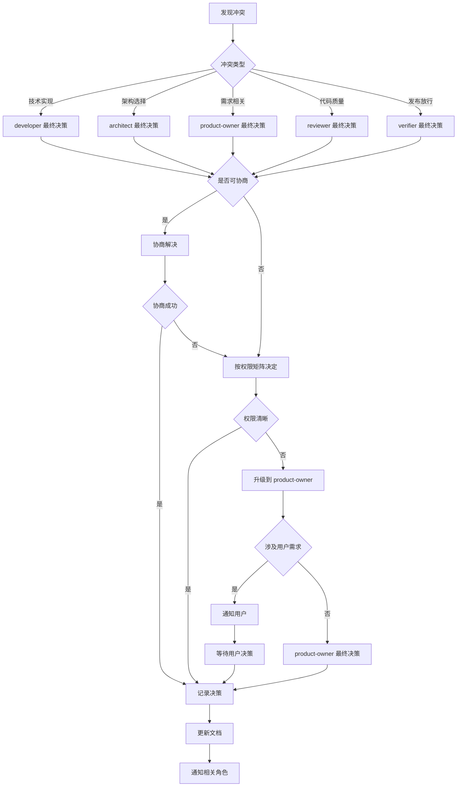
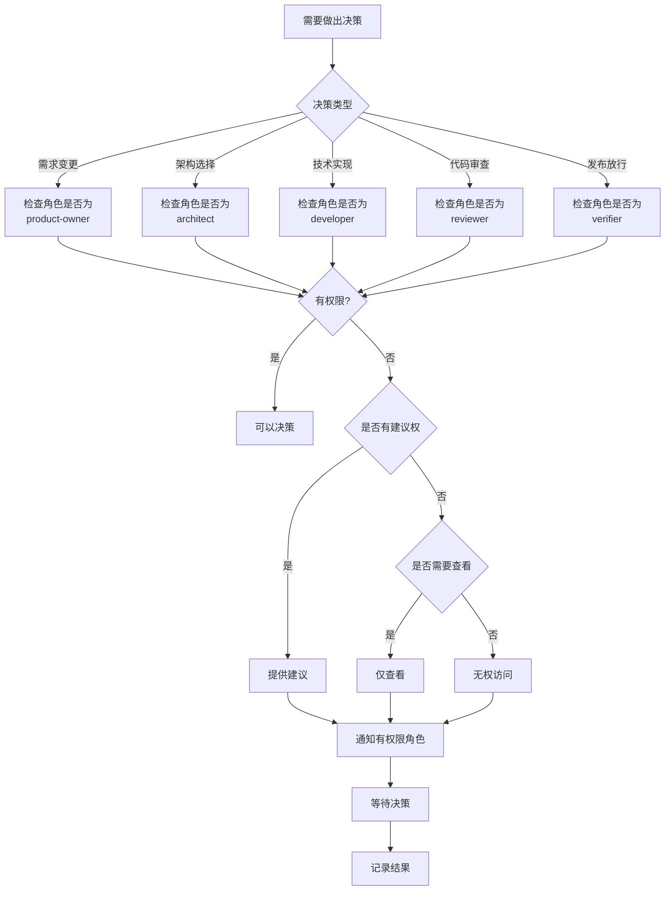

# 角色权限矩阵

## 1. 概述

### 1.1 理论基础

本权限矩阵基于以下研究和原则建立：

- **伯克利研究**：软件开发团队中"角色越权"是常见的失败模式。当开发者或评审者擅自修改需求或架构时，项目成功率显著下降。
- **HRO（高可靠性组织）原则**："尊重专业知识"是核心原则之一。每个角色在其专业领域内拥有决策权，同时尊重其他角色的专业判断。

### 1.2 设计原则

1. **权责明确**：每个角色的决策范围和信息访问权限清晰定义
2. **专业分工**：尊重各角色的专业领域
3. **层级有序**：遵循清晰的沟通层级
4. **制衡机制**：关键决策需要多方确认

---

## 2. 决策权限矩阵

### 2.1 决策权限表

| 决策类型 | product-owner | architect | developer | reviewer | verifier |
|:---------|:-------------:|:---------:|:---------:|:--------:|:--------:|
| **需求变更** | ✅ | 🗣️ | ❌ | ❌ | 📋 |
| **架构选择** | 🗣️ | ✅ | 📋 | 🗣️ | 📋 |
| **技术实现** | 📋 | 🗣️ | ✅ | 🗣️ | 📋 |
| **代码审查** | 📋 | 📋 | 🗣️ | ✅ | 📋 |
| **发布放行** | 🗣️ | 📋 | 📋 | 🗣️ | ✅ |

### 2.2 权限标记说明

| 标记 | 含义 |
|:-----|:-----|
| ✅ | **最终决策**：拥有该决策的最终决定权 |
| 🗣️ | **建议/确认**：可以提供建议，或对决策进行确认 |
| 📋 | **仅查看**：可以查看相关信息，但无权参与决策 |
| ❌ | **无权**：无权查看或参与该决策 |

### 2.3 决策权限详解

#### 2.3.1 需求变更
- **最终决策**：product-owner
- **建议权**：architect（可从技术可行性角度建议）
- **无权**：developer、reviewer、verifier（禁止擅自修改需求）

#### 2.3.2 架构选择
- **最终决策**：architect
- **建议权**：product-owner（从业务角度）、reviewer（从审查角度）
- **仅查看**：developer、verifier

#### 2.3.3 技术实现
- **最终决策**：developer（在其分配的代码范围内）
- **建议权**：architect（可提供技术指导）、reviewer（可建议改进）
- **仅查看**：product-owner、verifier

#### 2.3.4 代码审查
- **最终决策**：reviewer（对代码质量有最终决定权）
- **建议权**：developer（可解释实现思路）、architect（可提供架构层面建议）
- **仅查看**：product-owner、verifier

#### 2.3.5 发布放行
- **最终决策**：verifier（基于测试结果决定是否发布）
- **建议权**：product-owner（从业务时机角度）、reviewer（从代码质量角度）
- **仅查看**：architect、developer

---

## 3. 信息访问权限矩阵

### 3.1 信息访问权限表

| 信息类型 | product-owner | architect | developer | reviewer | verifier |
|:---------|:-------------:|:---------:|:---------:|:--------:|:--------:|
| **用户原始需求** | ✅ | ✅ | 📋 | 📋 | 📋 |
| **需求规格说明** | ✅ | ✅ | ✅ | ✅ | 📋 |
| **架构决策记录** | ✅ | ✅ | ✅ | ✅ | 📋 |
| **代码细节** | 📋 | ✅ | ✅ | ✅ | 📋 |
| **测试用例** | 📋 | 📋 | 📋 | 📋 | ✅ |
| **测试结果** | 🗣️ | 📋 | 📋 | 📋 | ✅ |
| **置信度报告** | ✅ | ✅ | 📋 | 📋 | ✅ |
| **错误日志** | 📋 | ✅ | ✅ | ✅ | ✅ |

### 3.2 访问权限说明

| 标记 | 含义 |
|:-----|:-----|
| ✅ | **完全访问**：可以查看、创建、修改该类型信息 |
| 🗣️ | **只读/摘要**：可以查看摘要或结果，但不能修改 |
| 📋 | **受限访问**：仅在需要时查看，无权修改 |

### 3.3 敏感信息规则

1. **用户原始需求**：仅 product-owner 和 architect 可直接访问，其他角色只能看到经过整理的规格说明
2. **代码细节**：product-owner 只能查看高层级摘要，不应关注实现细节
3. **测试结果**：product-owner 可看到最终报告，但不应干涉具体测试过程

---

## 4. 通信规则

### 4.1 向上沟通

下级向上级沟通时，必须遵循以下规则：

1. **充分理由**：必须提供数据、证据或逻辑支持
2. **明确请求**：清楚说明需要上级做什么（决策、确认、资源等）
3. **多个选项**：尽可能提供多个选项并说明利弊
4. **推荐方案**：可以给出推荐方案，但必须说明理由

**示例格式**：
```
【问题/请求】
【背景信息】
【选项分析】
- 选项A：[优点] / [缺点]
- 选项B：[优点] / [缺点]
- 选项C：[优点] / [缺点]
【推荐方案】选项X，理由是...
【需要行动】请决策/确认/提供资源
```

### 4.2 向下沟通

上级向下级沟通时，必须遵循以下规则：

1. **清晰明确**：指令必须具体、无歧义
2. **完整信息**：提供充分的背景和上下文
3. **可验证性**：目标必须可测量、可验证
4. **资源支持**：明确提供所需的资源和权限

**示例格式**：
```
【任务描述】
【背景/目标】
【具体要求】
1. 要求1
2. 要求2
3. 要求3
【验收标准】
- [具体标准1]
- [具体标准2]
【可用资源】
- [资源列表]
【截止时间】[具体时间]
```

### 4.3 平级沟通

平级角色之间沟通时，必须遵循以下规则：

1. **使用标准化协议**：使用团队定义的通信协议
2. **尊重专业边界**：不干涉对方专业领域的决策
3. **明确协作目标**：说明沟通目的和期望输出
4. **记录沟通结果**：重要沟通必须记录

### 4.4 跨级沟通

**原则：禁止跨级直接沟通，必须通过中间层级**

例外情况：
1. **紧急情况**：可以跨级沟通，但必须同时抄送中间层级
2. **明确授权**：获得中间层级明确授权后
3. **信息通知**：纯信息性通知（不需要决策或行动）

跨级沟通时必须：
- 明确说明为什么跨级
- 抄送所有中间层级
- 记录沟通原因和结果

---

## 5. 角色职责详细说明

### 5.1 Product Owner（产品负责人）

#### 主要职责
- 理解和明确用户需求
- 定义产品目标和验收标准
- 管理需求优先级
- 代表用户与团队沟通

#### 决策范围
- ✅ 需求变更的最终决策
- ✅ 产品功能优先级
- ✅ 验收标准定义
- ✅ 发布时机（从业务角度）

#### 禁止行为
- ❌ 指定具体技术实现方案
- ❌ 直接修改代码
- ❌ 绕过架构师做架构决策
- ❌ 无理由拒绝测试发现的问题

#### 期望输出
- 清晰的需求规格说明
- 明确的验收标准
- 优先级排序的需求列表
- 用户反馈的及时传递

---

### 5.2 Architect（架构师）

#### 主要职责
- 设计系统整体架构
- 制定技术标准和规范
- 评估技术方案的可行性
- 指导技术实现方向

#### 决策范围
- ✅ 架构选择的最终决策
- ✅ 技术栈选择
- ✅ 接口设计规范
- ✅ 性能和可靠性要求

#### 禁止行为
- ❌ 擅自修改用户需求
- ❌ 替代开发者做具体实现决策
- ❌ 绕过审查流程
- ❌ 忽视产品负责人的业务约束

#### 期望输出
- 架构设计文档
- 接口规范说明
- 技术选型报告
- 架构决策记录（ADR）

---

### 5.3 Developer（开发者）

#### 主要职责
- 按照需求和设计实现代码
- 遵循编码规范和最佳实践
- 参与技术方案讨论
- 配合代码审查

#### 决策范围
- ✅ 具体技术实现方案
- ✅ 代码结构和组织
- ✅ 变量和函数命名
- ✅ 实现细节优化

#### 禁止行为
- ❌ 擅自修改需求
- ❌ 修改已确认的架构设计
- ❌ 绕过代码审查流程
- ❌ 隐瞒已知问题

#### 期望输出
- 符合规范的代码
- 清晰的代码注释
- 实现说明文档
- 测试配合

---

### 5.4 Reviewer（审查者）

#### 主要职责
- 审查代码质量和正确性
- 检查是否符合需求和设计
- 发现潜在问题和风险
- 提供改进建议

#### 决策范围
- ✅ 代码是否通过审查
- ✅ 代码质量标准
- ✅ 重构建议
- ✅ 安全性问题识别

#### 禁止行为
- ❌ 强行指定实现方式
- ❌ 基于个人偏好拒绝代码
- ❌ 修改代码（只能建议）
- ❌ 忽视已确认的架构决策

#### 期望输出
- 详细的审查报告
- 问题清单和优先级
- 改进建议
- 审查通过/不通过决策

---

### 5.5 Verifier（验证者）

#### 主要职责
- 设计和执行测试用例
- 验证系统功能和性能
- 报告测试结果和问题
- 决定是否可以发布

#### 决策范围
- ✅ 测试策略设计
- ✅ 发布放行决策
- ✅ 问题严重性评级
- ✅ 测试覆盖率要求

#### 禁止行为
- ❌ 修改需求或代码
- ❌ 基于非测试因素放行
- ❌ 隐瞒测试发现的问题
- ❌ 降低测试标准

#### 期望输出
- 测试计划和用例
- 测试执行报告
- 问题清单和严重性
- 发布建议

---

## 6. 冲突解决机制

当不同角色对同一决策有不同意见时，按以下流程解决：



### 6.1 冲突解决步骤

1. **识别冲突类型**
   - 确定冲突属于哪个决策类型
   - 明确涉及的角色

2. **尝试协商**
   - 各方陈述观点和理由
   - 寻找妥协方案
   - 记录协商过程

3. **按权限矩阵决定**
   - 如果协商失败，按权限矩阵决定
   - 拥有最终决策权的角色做决定

4. **权限不清时升级**
   - 如果权限矩阵未覆盖该情况
   - 升级到 product-owner

5. **涉及用户需求时通知用户**
   - 如果冲突影响用户需求
   - 必须通知用户并等待决策

### 6.2 冲突解决记录

所有冲突及其解决方式必须记录，包括：
- 冲突描述
- 涉及角色
- 各方观点
- 解决方案
- 最终决策者
- 经验教训

---

## 7. 权限检查流程

### 7.1 权限检查流程图



### 7.2 权限检查清单

在做出任何决策前，角色应检查：

- [ ] 这是哪个类型的决策？
- [ ] 我对该决策类型有什么权限？
- [ ] 我是否有充分的信息？
- [ ] 是否需要征求其他角色的建议？
- [ ] 决策是否需要记录？
- [ ] 决策是否需要通知其他角色？

### 7.3 权限验证API示例

```python
class RolePermissionMatrix:
    """角色权限矩阵验证"""

    # 决策权限
    DECISION_PERMISSIONS = {
        "requirement_change": {
            "product-owner": "decide",
            "architect": "suggest",
            "developer": "none",
            "reviewer": "none",
            "verifier": "view"
        },
        "architecture_choice": {
            "product-owner": "suggest",
            "architect": "decide",
            "developer": "view",
            "reviewer": "suggest",
            "verifier": "view"
        },
        # ... 其他决策类型
    }

    @classmethod
    def check_permission(cls, role: str, decision_type: str) -> str:
        """
        检查角色对决策类型的权限

        返回: "decide", "suggest", "view", "none"
        """
        if decision_type not in cls.DECISION_PERMISSIONS:
            return "none"

        return cls.DECISION_PERMISSIONS[decision_type].get(role, "none")

    @classmethod
    def can_decide(cls, role: str, decision_type: str) -> bool:
        """检查角色是否有决策权"""
        return cls.check_permission(role, decision_type) == "decide"

    @classmethod
    def can_suggest(cls, role: str, decision_type: str) -> bool:
        """检查角色是否有建议权"""
        permission = cls.check_permission(role, decision_type)
        return permission in ["decide", "suggest"]
```

---

## 8. 实施指南

### 8.1 新成员入职

1. 确认分配的角色
2. 学习本权限矩阵文档
3. 理解角色的决策范围
4. 学习沟通规则
5. 通过权限测试

### 8.2 定期审查

1. 每个迭代后审查权限使用情况
2. 记录权限模糊的情况
3. 更新权限矩阵
4. 培训团队成员

### 8.3 常见问题

**Q: 如果紧急情况下需要越权怎么办？**
A: 可以越权，但必须：
1. 明确说明是紧急情况
2. 通知有权限的角色
3. 记录越权原因和过程
4. 事后获得追认

**Q: 如果权限矩阵未覆盖某情况怎么办？**
A: 升级到 product-owner 决策，并更新权限矩阵。

**Q: 如果对权限分配有异议怎么办？**
A: 向 product-owner 提出建议，说明理由。product-owner 决定是否调整。

---

## 9. 参考文档

- [伯克利软件工程研究：角色越权问题]
- [HRO 高可靠性组织原则]
- [RACI 责任分配矩阵]
- [团队决策最佳实践]

---

## 附录：权限矩阵快速参考

### 决策权限速查表

| 角色 | 需求 | 架构 | 实现 | 审查 | 发布 |
|:-----|:----:|:----:|:----:|:----:|:----:|
| PO | ✅ | 🗣️ | 📋 | 📋 | 🗣️ |
| ARCH | 🗣️ | ✅ | 🗣️ | 📋 | 📋 |
| DEV | ❌ | 📋 | ✅ | 🗣️ | 📋 |
| REV | ❌ | 🗣️ | 🗣️ | ✅ | 🗣️ |
| VER | 📋 | 📋 | 📋 | 📋 | ✅ |

*PO = product-owner, ARCH = architect, DEV = developer, REV = reviewer, VER = verifier*
