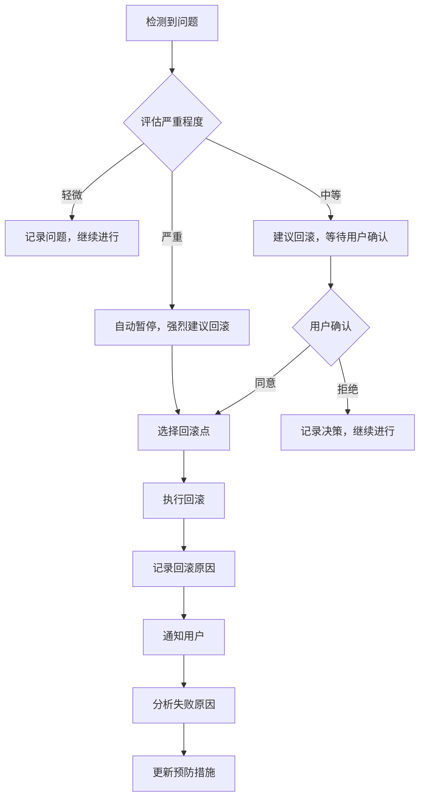

# 回滚恢复系统

> 给非技术用户的一句话说明：**就像游戏里的"存档点"一样，我们在重要时刻自动保存进度。如果出现问题，可以随时回到之前的状态，您永远不会失去已经完成的工作。**

---

## 1. 概述

### 对您意味着什么

当我们一起工作时，您可能会担心：

- "如果 AI 做错了怎么办？"
- "如果我改变了主意，还能回到之前吗？"
- "会不会把之前好的工作弄丢了？"

**回滚恢复系统就是为解决这些担忧而设计的。**

### 系统可恢复性的核心价值

| 价值点 | 说明 |
|--------|------|
| **安全感** | 您可以放心尝试，因为随时可以回头 |
| **可追溯** | 每个关键决策都有记录，方便回顾 |
| **零损失** | 即使出错，已完成的 work 也不会丢失 |
| **透明化** | 您始终知道系统处于什么状态 |

---

## 2. 检查点策略

### 什么是检查点？

检查点（Checkpoint）就像游戏中的"存档"。我们在工作过程中会自动创建多个检查点，每个检查点保存了当时的完整状态。

### 触发时机

系统会在以下情况下自动创建检查点：

| 触发场景 | 说明 |
|----------|------|
| 每个 Phase 完成后 | 例如：需求分析完成、设计方案确定 |
| 重要决策确认后 | 例如：您选择了某个技术方案 |
| 代码提交前 | 在代码变更被记录前 |
| 用户确认里程碑后 | 当您表示"这部分可以了"之后 |

### 检查点内容

每个检查点保存：

```yaml
检查点包含:
  代码状态: 当前所有文件的快照
  配置文件: 项目设置的完整记录
  需求锁定: 您确认过的需求内容
  任务进度: 哪些已完成、哪些进行中
  Agent 上下文: AI 对当前状态的理解摘要
```

### 存储策略

```yaml
storage:
  location: ".claude/checkpoints/"
  naming: "checkpoint-<phase>-<timestamp>.json"
  maxAge: "7 days"      # 保留7天
  maxCount: 50          # 最多保留50个检查点
```

**您不需要担心存储空间**，系统会自动清理旧的检查点。

---

## 3. 回滚触发条件

### 自动触发

系统会在检测到以下情况时**自动建议回滚**：

| 触发条件 | 说明 |
|----------|------|
| 验证失败超过 3 次 | 同一个问题反复出现 |
| 置信度低于 0.5 | AI 对当前方向不够确定 |
| 需求偏离检测 | 发现结果与您的要求不符 |

### 手动触发

您也可以**主动要求回滚**：

- "我不喜欢这个结果，能回到之前吗？"
- "这方向好像不对，重新来过"
- 发现了严重的安全问题

---

## 4. 回滚点选择

系统会按照以下优先级帮您选择最合适的回滚点：

```
优先级 1: 上一个检查点（最近的安全状态）
     ↓
优先级 2: 需求锁定点（您明确确认过的状态）
     ↓
优先级 3: 用户指定点（您选择的任意检查点）
```

### 如何选择回滚点？

您可以用简单的语言表达：

- "回到上一步"
- "回到需求确认的时候"
- "回到昨天那个版本"

---

## 5. 恢复流程



### 步骤说明

1. **检测到问题** - 系统发现异常或您报告问题
2. **评估严重程度** - 判断是需要回滚还是可以继续
3. **选择回滚点** - 根据情况选择最合适的检查点
4. **执行回滚** - 恢复到选定的状态
5. **记录回滚原因** - 保存到日志供后续分析
6. **通知用户** - 用通俗语言告诉您发生了什么

---

## 6. 回滚后的处理

### 分析阶段

系统会自动：

- 分析失败的根本原因
- 记录到"组织记忆库"（避免重复犯错）
- 更新置信度模型（下次更准确地判断）

### 预防阶段

| 情况 | 处理方式 |
|------|----------|
| 首次遇到 | 创建新的预防规则（instinct） |
| 重复遇到 | 提高该场景的检查优先级 |
| 无法预防 | 建议流程改进 |

### 沟通阶段

系统会用**简单的语言**告诉您：

> "刚才的操作遇到了问题。我已经把项目恢复到之前的安全状态。
>
> 问题原因：[用非技术语言解释]
> 已采取措施：[说明做了什么预防]
> 您可以：继续修改 / 查看详情 / 终止项目"

---

## 7. 用户友好的回滚说明

### 回滚是什么？（通俗解释）

想象您在编辑文档：

- **保存** = 检查点
- **撤销** = 回滚

我们的系统就是在这个基础上更强大——它可以保存整个项目的状态，而不仅仅是一个文档。

### 为什么需要回滚？

| 原因 | 类比 |
|------|------|
| 代码出现 bug | 就像文档编辑出错 |
| 方向不符合预期 | 就像走错路需要返回 |
| 功能无法正常运行 | 就像安装失败需要重装 |

### 回滚后会怎样？

✅ **会发生的：**
- 代码恢复到之前的状态
- 配置恢复到之前的设置
- 您会清楚地知道回到了哪个点

❌ **不会发生的：**
- 不会丢失您的对话记录
- 不会丢失已保存的检查点
- 不会"无法挽回"

### 您需要做什么？

通常情况下，**您什么都不需要做**。系统会自动处理一切。

如果您想要主动控制：
- 可以随时说"回到上一步"
- 可以说"创建检查点"（手动存档）
- 可以问"有哪些检查点可用"

---

## 8. 检查点数据结构

### 技术细节（供开发者参考）

```typescript
interface Checkpoint {
  // 唯一标识
  id: string;

  // 时间戳
  timestamp: string;

  // 所属阶段（如：requirement、design、implementation）
  phase: string;

  // 关联任务 ID
  taskId: string;

  // 快照内容
  snapshot: {
    // 代码状态：git commit hash 或 diff
    code: string;

    // 配置文件
    config: Record<string, any>;

    // 需求列表
    requirements: Requirement[];

    // 任务进度
    progress: TaskProgress;
  };

  // 元数据
  metadata: {
    // 触发原因（auto、manual、milestone）
    trigger: string;

    // 各 Agent 的状态
    agentStates: AgentState[];

    // 系统对该状态的信心程度（0-1）
    confidence: number;
  };
}

interface TaskProgress {
  completed: string[];
  inProgress: string[];
  pending: string[];
}

interface AgentState {
  role: string;
  context: string;
  status: 'active' | 'waiting' | 'completed';
}
```

---

## 9. 常见问题

### Q: 回滚会丢失我的数据吗？

**A：不会。** 检查点就像是"保存点"，所有的检查点都会保留。回滚只是切换到另一个检查点，不会删除任何数据。

### Q: 我可以回滚到任意时间点吗？

**A：** 只要那个时间点有检查点，就可以。系统会在关键时刻自动创建检查点，您也可以手动创建。

### Q: 回滚需要多长时间？

**A：** 通常几秒钟。对于大型项目可能需要更长时间，但不会超过几分钟。

### Q: 我会知道什么时候发生了回滚吗？

**A：** 会。系统会明确通知您发生了什么以及原因。

---

## 10. 最佳实践

### 给用户的建议

1. **信任系统** - 让自动检查点为您工作
2. **明确确认** - 当您满意某个结果时明确说"可以了"
3. **及时反馈** - 发现问题越早，回滚成本越低

### 给开发者的建议

1. **检查点粒度** - 在关键决策点创建检查点
2. **存储效率** - 使用增量存储减少空间占用
3. **恢复测试** - 定期验证检查点的可用性

---

*最后更新：2025-02-18*
*版本：1.0.0*
