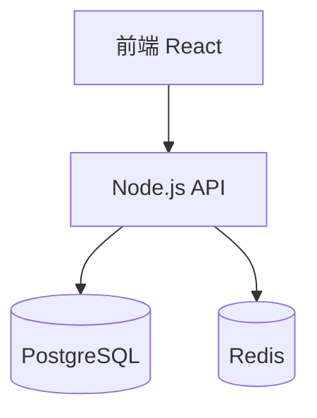

# 项目架构知识库

## 架构决策记录 (ADRs)

### ADR-001: 技术栈选择
- **日期**: 2026-XX-XX
- **决策**: 使用 React + TypeScript + Node.js
- **原因**: 团队熟悉度高，生态成熟
- **替代方案**: Vue + Python (放弃原因：学习成本高)

### ADR-002: 数据库选型
- **日期**: 2026-XX-XX
- **决策**: PostgreSQL + Redis
- **原因**: 关系型数据 + 缓存需求

## 系统边界

## 关键模式

| 模式 | 使用场景 | 文件位置 |
|------|----------|----------|
| Repository | 数据访问 | `src/repositories/` |
| Service | 业务逻辑 | `src/services/` |
| Controller | API 处理 | `src/controllers/` |
